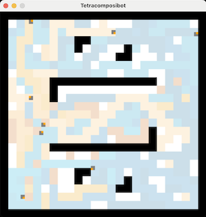

# =-= TETRACOMPOSIBOT =-=

_"With the Tetracomposibot it has now become possible to play and compose REAL simple robot demo"_

* contact  : nicolas.bredeche at sorbonne-universite dot fr
* initiated : 2025-03-25
* revised : 2025-03-31

**Description**
* A simple simulator for playing with one... to many robots
* Un simulateur très simple pour jouer avec un ou plusieurs robots

**Dependencies**
* Python 3.x
* PyGame
* Numba (not available? use _tetracomposibot_noOpt.py_ instead)

**Running**
* Demo: _python tetracomposibot.py_
* Help: _python tetracomposibot.py -h_

# Exécution du simulateur

Pour lancer une expérience:
- méthode 1: en ligne de commande, _python tetracomposibot.py_. Utilise config.py comme fichier par défaut.
- méthode 2: en ligne de commande, _python tetracomposibot.py <fichier config>_. Par exemple: _python tetracomposibot.py config_Paintwars_. Vous pouvez créer/modifier votre fichier de configuration comme il vous plaira.
- méthode 3: en ligne de commande, avec des paramètres. Cf. _python tetracomposibot.py -h_. Par exemple: _python tetracomposibot.py config_Paintwars 1 False 0_

# Création d'un nouveau projet

Fichier à ne **pas** modifier (cas général):
- le fichier _arenas.py_ contient la définition de toutes les arènes disponibles (100x100 pixels, divisés en 25x25 cases)
- le fichier _tetracomposibot.py_ contient le simulateur

Fichiers utilisateurs, modifiables:
- Robot: Le comportement d'un type de robot est défini dans un fichier dédié, par exemple _robot_wanderer.py_. Ce fichier doit spécifier trois fonctions: _init_, _reset_ et _step_. La fonction _step_ permet de spécifier le comportement du robot à chaque pas de temps (vitesse normale: 60 appels par seconde). Cette fonction retourne la vitesse de translation souhaitée, la vitesse de rotation souhaitée, et un booléen pour éventuellement demander une remise à zéro de la simulation (False: pas de remise à zéro -- c'est le mode normal).
- Configuration: Le dispositif expérimental (choix de l'arène, rendu graphique, nombre d'itérations, etc.) sont définis dans un fichier Python de configuration, par exemple _config.py_. Ce fichier contient aussi une fonction permettant d'initialiser la position des robots au début de la simulation. Le fichier de configuration permet de fixer les paramètres généraux de la situation. Certains peuvent être écrasés en ligne de commande (numéro de l'arène, position de départ, vitesse de rendu, nombre maximum d'itérations). Les autres paramètres permettent de choisir quels sont les messages à afficher dans le terminal. Ce fichier contient aussi une fonction _initialize_robots_ permettant de placer les robots avant que la simulation ne commence. A noter que le simulateur traite des coordonnées continues pour chaque robot, dans les limites des dimensions de l'arène. Le simulateur utiliser une orientation absolue du robot dans l'arène, codée en degré (ex.:[0...360[ ou [-180,+180[)

Pour créer un nouveau projet:
1. créer un fichier configuration (cf. _config.py_ pour un exemple)
2. créer un fichier robot (cf. _robot_wanderer.py_ pour un exemple)
3. lancer la simulation en donnant le fichier configuration en paramètre (avec ou sans l'extension .py): _python tetracomposibot.py ma_config_

cf. _python tetracomposibot.py -h_ pour voir quels sont les paramètres que l'on peut passer en ligne de commande.

# Infos techniques

**ROBOT**

un robot est représenté par un carré de 2x2, avec un point donnant la direction. En pratique la localisation et l'orientation du robot existent dans un domaine continu (x et y \in R, \theta \in [0.0,360.0[).

La fonction step(.) est appelé à chaque pas du simulateur (env. 60x par seconde si display_mode=0). La dernière valeur de translation et rotation est prise en compte. Les senseurs sont mis à jour pour chaque appel.

**EFFECTEURS**

Un robot est controllable par sa vitesse de translation et sa vitesse de rotation.

translation: entre -1.0 (aller en arrière) et +1.0 (aller en avant). 0 pour un robot immobile
rotation: entre -1.0 et +1.0. 

Il s'agit de valeur normalisée. En particulier, la rotation maximale par pas de temps est limité en degrés (ici: 3° max.) 

**SENSEURS**

Un robot dispose de 8 senseurs répartis autour de lui (écart de 45° entre chaque senseur).

Numérotation des senseurs dans le sens inverse des aiguilles d'une montre. Valeur 0 pour le senseur orienté vers l'avant du robot. Il est possible d'obtenir 3 types d'information des senseurs, chacune étant stockées dans une liste dédiée.

* _sensors_ : sensors (distance, max is 1.0)
* _sensor_view_ : type (if any) of sensed obstacle (0:empty, 1:wall, 2:robot)
* _sensor_robot_ : robot's team (if relevant -- otherwise: "n/a")

Les variables suivantes sont pré-définies pour permettre une utilisation plus intuitive:

* _sensor_front = 0_
* _sensor_front_left = 1_
* _sensor_left = 2_
* _sensor_rear_left = 3_
* _sensor_rear = 4_
* _sensor_rear_right = 5_
* _sensor_right = 6_
* _sensor_front_right = 7_

Par exemple, _sensors[sensor_left]_ renvoie la distance normalisée (ie. entre 0.0 et 1.0) à l'obstacle s'il existe. _sensor_view[sensor_left_]_ renvoie le type d'obstacle (s'il existe).

# F.A.Q

* Q: la librairie Numba n'est pas installée ou ne fonctionne pas sur ma machine (problème pour utiliser njit)
* R: utilisez tetracomposibot_noOpt.py -- plus lent, mais la seule dépendance nécessaire est pyGame
